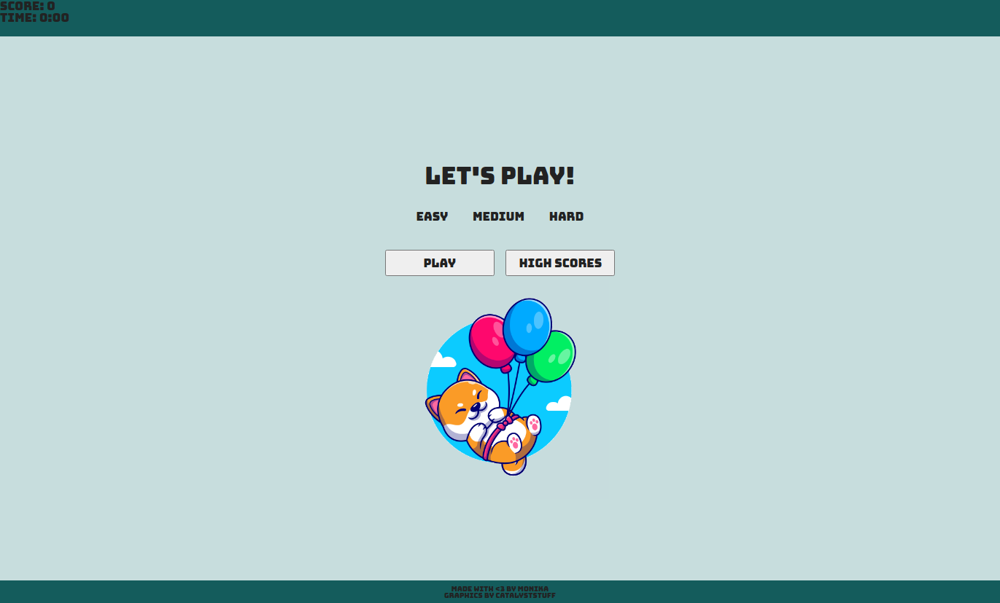
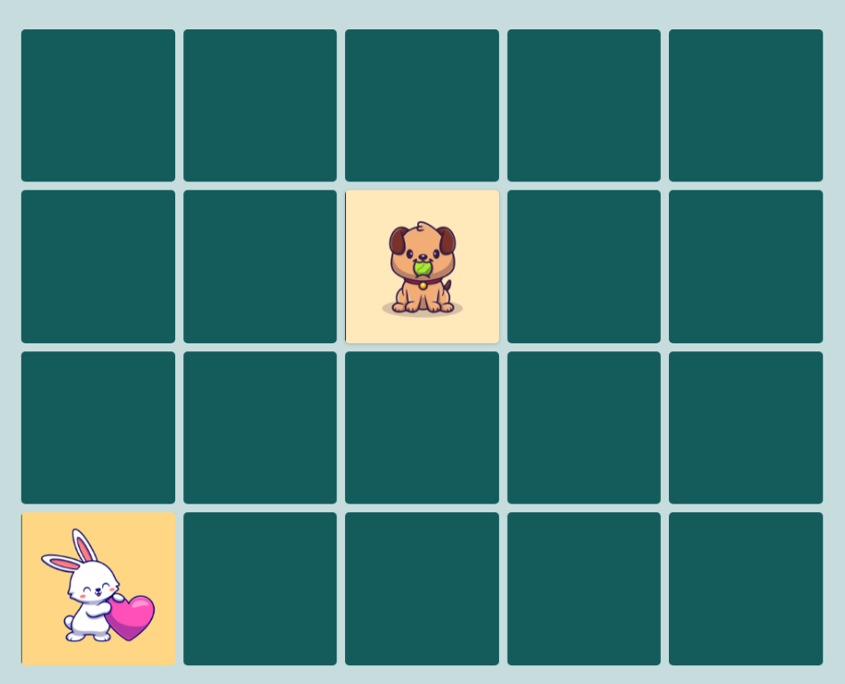

# Project Name

> Simple memory game with cute images.
> Live demo [_here_](https://kind-lichterman-d1aa49.netlify.app/).

## Table of Contents

- [General Info](#general-information)
- [Technologies Used](#technologies-used)
- [Features](#features)
- [Screenshots](#screenshots)
- [Project Status](#project-status)
- [Acknowledgements](#acknowledgements)

## General Information

- Simple memory game.
- Game was made for practice programming skills.

## Technologies Used

- JavaScript
- HTML
- SASS

## Features

List the ready features here:

- Working algorithm memory game
- One difficulty level

To do:

- difficulty levels (more tiles)
- score list with using Firebase
- fix time and score counter
- "you win" popup
- fix bug with hiding tiles
- version for mobile phones

## Screenshots

## Project Status

Project is: _in progress_

## Acknowledgements

- This project was based on [this tutorial](https://kursjs.pl/kurs/gry/memory/memory.php).
- Many thanks to [Catalystuff](https://pl.freepik.com/catalyststuff) for cute images.
